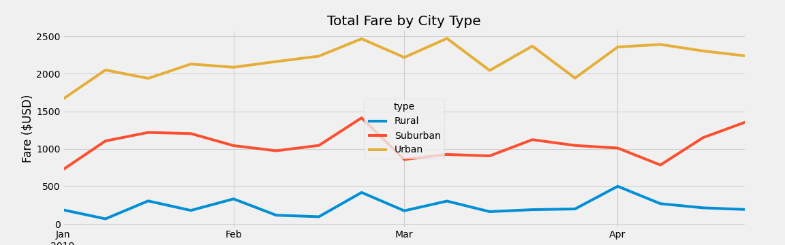

# PyBer_Analysis

## Overview
Here we are analyzing rideshare data to compare weekly fares for 3 different city type - rural, suburban, and urban. 

## Results

Based on the line chart, we can see that total fare increases with higher trafficked. Rural areas have a higher average fare while urban cities are a lot cheaper per ride and per driver. While March seems to be a slightly busier time of year in all city types, there isn't much fluctuation other than a rapid increase in rideshares in suburban areas around mid-April.

## Summary
Data shows that larger cities have more of a demand for rideshares, but fare per ride and per driver is lowest. Since demand for drivers is much lower, we can conclude that rural areas need more drivers to drive down fares. Because fare is so high in rural areas, it is possible rides are much further in distance compared to suburban and urban cities, so people are spending more on rides than they would in higher trafficked areas. In order to increase demand, an increase in drivers is needed as this would cut down driving time by finding drivers more close by and making it more convenient for people to use rideshare apps in rural areas.
